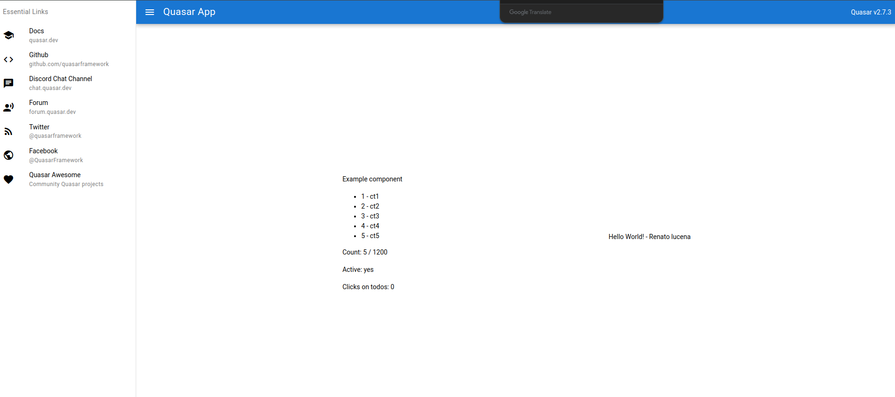

# Quasar App (quasar-project)



## A Quasar Project

➜  docker-compose -f ./docker-compose.dev.yml up --build

### Build the app for production

```bash
quasar build
```


# Quasar Framework

> Build high-performance VueJS user interfaces in record time: responsive Single Page Apps, SSR Apps, PWAs, Browser extensions, Hybrid Mobile Apps and Electron Apps. If you want, all using the same codebase!

      

[](https://chat.quasar.dev)
<a href="https://forum.quasar.dev" target="_blank"></a>
[](https://good-labs.github.io/greater-good-affirmation)

[](https://github.com/quasarframework/quasar/actions/workflows/tests-on-pr.yml)

Please submit a PR to https://github.com/quasarframework/quasar-awesome with your website/app/Quasar tutorial/video etc. Thank you!

### Customize the configuration

See [Configuring quasar.config.js](https://v2.quasar.dev/quasar-cli-webpack/quasar-config-js).

- quasar.dev
